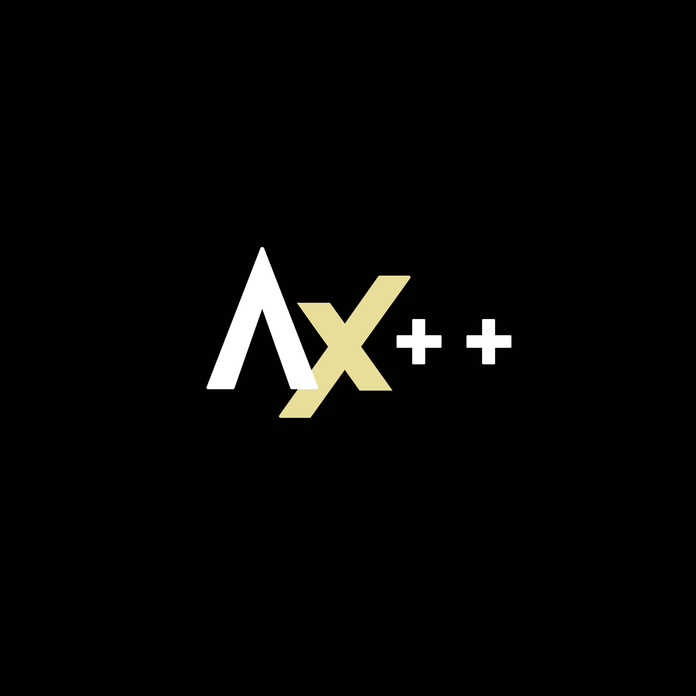

**A lightweight neural network library built from scratch in modern C++.**

Axion++ is a proof-of-concept educational neural network library that builds every major component from first principles starting with linear algebra and evolving incrementally into a complete deep learning engine. It relies on no external ML frameworks and is designed to be read, understood, and extended. Status: **Under Construction**

---

[](https://github.com/vk22006/axion-plusplus/actions/workflows/testing.yaml)
[](LICENSE)


## Features (v0.1.0)

### Matrix Library

| Operation | Description |
|-----------|-------------|
| `Matrix(rows, cols)` | Zero-initialized matrix |
| `Matrix(axion::matrix)` | Construct from 2D vector |
| `identity(n)` | Convert to n×n identity matrix |
| `fill(val)` | Fill entire matrix with a value |
| `A + B`, `A - B`, `A * B` | Matrix–matrix arithmetic |
| `A + x`, `A - x`, `A * x`, `A / x` | Scalar arithmetic |
| `transpose()` | Returns the transposed matrix |
| `A(i, j)` | Element access |
| `A == B`, `A != B` | Equality comparison |
| `rows_()`, `cols_()` | Dimension accessors |
| `cin >> A`, `cout << A` | Stream I/O |

### Exceptions

All errors derive from `axion::AxionError`:

- `MatrixDimensionError` — incompatible shapes
- `InvalidIndexError` — out-of-bounds access
- `InvalidShapeError` — malformed construction
- `DivisionByZeroError` — scalar division by zero

## Building

**Requirements:** CMake ≥ 3.20, C++20 compiler, Ninja (optional)

```bash
git clone https://github.com/vk22006/axion-plusplus.git
cd axion-plusplus

cmake -S . -B build -G Ninja
cmake --build build
```

### Run Tests

```bash
ctest --test-dir build --output-on-failure
```

### Generate Documentation

```bash
cmake --build build --target doc
```

Docs are generated into the `docs/` directory using Doxygen.

## Quick Start

```cpp
#include <iostream>
#include <axion/matrix.hpp>

int main() {
    // Construct from a 2D initializer list
    axion::Matrix A({
        {1, 2, 3},
        {4, 5, 6},
        {7, 8, 9}
    });

    // Matrix arithmetic
    axion::Matrix B = A * 2;
    axion::Matrix C = A + B;

    // Transpose
    axion::Matrix T = A.transpose();

    // Element access
    std::cout << "A(1,1) = " << A(1, 1) << "\n";

    // Dimensions
    std::cout << "Rows: " << A.rows_() << ", Cols: " << A.cols_() << "\n";

    // Stream output
    std::cout << C;

    return 0;
}
```

More examples are in the [`examples/`](examples/) directory.

## Project Structure

```text
axion-plusplus/
├── include/axion/     # Public headers
│   ├── config.hpp     # Core type aliases
│   ├── version.hpp    # Version constants
│   ├── exceptions.hpp # Exception hierarchy
│   └── matrix.hpp     # Matrix class
├── src/               # Implementation files
├── tests/             # CTest unit tests (9 suites)
├── benchmarks/        # Matrix performance benchmarks
├── examples/          # Standalone usage examples
├── docs/              # Doxygen-generated documentation
└── CMakeLists.txt
```

## Roadmap

Axion++ grows incrementally. Planned milestones beyond v0.1.0:

- **v0.2.0** — Dense (fully-connected) layer
- **v0.3.0** — Activation functions (ReLU, Sigmoid, Tanh)
- **v0.4.0** — Loss functions and optimizer (gradient descent)
- **v0.5.0** — Backpropagation engine
- **v1.0.0** — Model persistence, dataset utilities, full training pipeline

The project intentionally prioritizes clarity and maintainability over raw performance.

## Technologies

| Tool | Purpose |
|------|---------|
| C++20 | Core language |
| CMake | Build system |
| CTest | Unit testing |
| Doxygen | API documentation |
| GitHub Actions | Continuous integration |

## Contributing

Contributions, bug reports, and suggestions are welcome!
Please read [CONTRIBUTING.md](CONTRIBUTING.md) before opening a pull request.

## Changelog

See [CHANGELOG.md](CHANGELOG.md) for a full history of changes.

## License

This project is licensed under the [MIT License](LICENSE) — © 2026 Kishore V.
